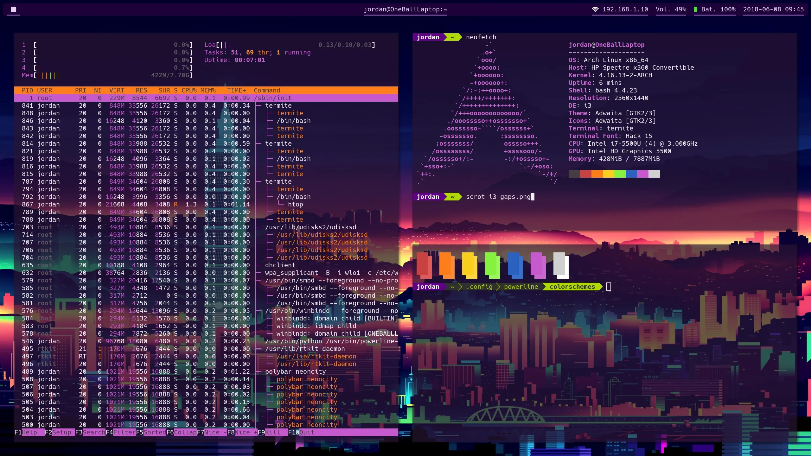
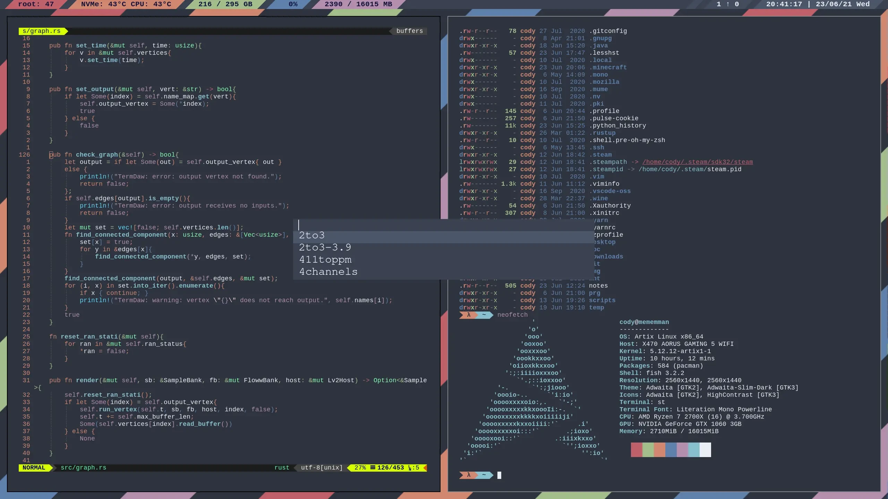

# Section-1 (Linux & Bash) 🐧

Welcome to the first week of the first module of LS: Tools for Cyber Security! 
The topics we will study this week are <b>Linux</b> and <b>Shell Scripting</b>.  
 
Linux is an operating system just like Windows and MacOS. An operating system is a piece of code that enables the computer software to communicate and operate with the computer hardware easily. Unlike Windows and MacOS though, Linux is free and open-source. What this means is that you don't need to pay to use Linux and can even look at the [source code](https://github.com/torvalds/linux) yourself (unlike other operating systems where the source code is a trade secret). 
The freedom and simplicity Linux offers make it a popular choice among developers and hackers. Hence, many applications that we will use throughout this course are exclusively available on Linux systems. Apart from all this, Linux is much more reliable, performant and customizable than other operating systems.

  
  &nbsp&nbsp&nbsp&nbsp&nbsp&nbsp
   
  An average linux user's desktop

There are a lot of ways to get a Linux system running on your computer : you may choose to dual boot Linux with Windows, install WSL2 on windows (Window's Subsystem for Linux) or use Linux in a Virtual Machine.  
For the sake of this course, you are recommended to use a [Virtual Machine](https://www.parrotsec.org/download/) which comes preinstalled with most of the cyber security tools you will ever need. You will also have to install a virtual box manager: [VMWare](https://www.vmware.com/content/vmware/vmware-published-sites/us/products/workstation-player/workstation-player-evaluation.html.html.html) or [VirtualBox](https://www.virtualbox.org/wiki/Downloads) are good options. 
If you choose to dual boot or use WSL, you will need to select a "distribution" of Linux to install. [Ubuntu](https://ubuntu.com/) is a popular choice among beginners, but you may search for and use alternatives. There are plenty of tutorials on the web for doing so. 

Unfortunately though, those with Mac M1 laptops will not be able to enjoy the benefits of Linux just yet due to the unavailable virtualbox and ofcourse other things.
However, the good news is that most of the commands which we will be employing this time would also be usable from Mac OS itself and thus, Mac users(not just M1 users) do not
necessarily need to install Linux right away. In the longer term though, Linux would turn out be more important than anything else and we will be looking into possible
solutions which can be employed, albeit a little later.

This week's content also includes an introduction to shell scripting. Shell scripting enables one to automate tasks that otherwise require [100s](https://www.youtube.com/watch?v=K19COVM5XuA) of mouse clicks and other kinds of interesting stuff as well. The resources provided below will help you gain familiarity with both linux and shell scripting. After going through them, you can practice and hone your command line skills by playing the wargame linked in the `Practice` section. If you are wondering how all this is relevant to hacking or solving CTF (capture the flag) challenges, we even have several video walkthroughs for the same linked below.  

### Introductory Videos : 
1. [What is Linux used for?](https://www.youtube.com/watch?v=YA-3NI_Lfns)  (5 mins)
2. [Beginner's Guide To The Linux Terminal](https://www.youtube.com/watch?v=s3ii48qYBxA) (40 mins)
3. [Write Your Own Bash Scripts for Automation](https://www.youtube.com/watch?v=PPQ8m8xQAs8) (15 mins)

### Text Guides : [ bi0s 🙏 ]
1. Linux+Python intro  : [Getting Started - bi0s wiki](https://wiki.bi0s.in/basics/intro/) 
2. Commands : [Linux Commands - bi0s wiki](https://wiki.bi0s.in/basics/linux_commands/) | [Basics of Linux](https://d00mfist.gitbooks.io/ctf/content/basics_of_linux.html)
3. Bash Scripting : [Bash conditions and loops - bi0s wiki](https://wiki.bi0s.in/basics/one_liners/) | [Bash Scripting Tutorial](https://ryanstutorials.net/bash-scripting-tutorial/)
4. Stdin, Stderr, Stdout: [Files - bi0s wiki](https://wiki.bi0s.in/basics/files/)

### Our Introductory Sessions : 
[CSeC - Introduction to Linux - MSTeams Recording](https://iitbacin.sharepoint.com/sites/CSecClub/Shared%20Documents/Forms/AllItems.aspx?FolderCTID=0x012000AE7DBDF52AA7E4479C2DEFD6FD00A9F1&id=%2Fsites%2FCSecClub%2FShared%20Documents%2FGeneral%2FRecordings%2FIntroductory%20Workshop%20%5F1%20%5F%20Introduction%20to%20Linux%2D20211229%5F180735%2DMeeting%20Recording%2Emp4&parent=%2Fsites%2FCSecClub%2FShared%20Documents%2FGeneral%2FRecordings) |
[CSeC - Introduction to Linux - PPT](https://iitbacin.sharepoint.com/sites/CSecClub/Shared%20Documents/Forms/AllItems.aspx?FolderCTID=0x012000AE7DBDF52AA7E4479C2DEFD6FD00A9F1&id=%2Fsites%2FCSecClub%2FShared%20Documents%2FGeneral%2FLinux%5FIntro%5FSession%5F29%2D12%2D21)

### CTF challenge walkthroughs : 
1. Indroduction to Linux and CTFs [Capture The Flag - picoCTF 2021](https://www.youtube.com/watch?v=P07NH5F-t3s) (22 mins)
2. find, scripting [Leaf of the Forest - picoCTF 2017](https://www.youtube.com/watch?v=uXAhcrXuPwI) | [Writing a GetFlag Script in BASH - picoCTF 2017](https://www.youtube.com/watch?v=94UKnT83_Vg) (5+5 mins)
3. nc,grep,cut,tr [WorldChat - picoCTF 2017](https://www.youtube.com/watch?v=5WCK51Oj6iE) (10 mins)
4. bash for-loops [Bash Loop - picoCTF 2017](https://www.youtube.com/watch?v=1i_HysJ4RXM) (8 mins)
5. files \[stdin, stderr, stdout\] [Piping Stdin & Redirecting Stderr - picoCTF 2018](https://www.youtube.com/watch?v=_eNqR96OLCQ) (5 mins)
6. symbolic links [Just No - picoCTF 2017](https://www.youtube.com/watch?v=IicZGJM2kv8) (8 mins)
    
### Practice :
- [OverTheWire: Bandit](https://overthewire.org/wargames/bandit/)

Discussions among students are encouraged and we request you to use the respective Team on MS Teams for the same.

Created with :heart: by <a href="https://cseciitb.github.io/">CSeC</a>

